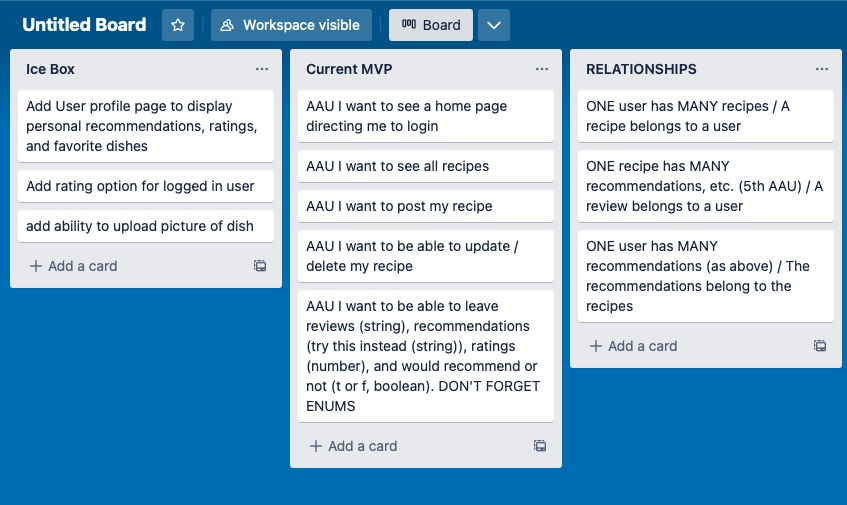
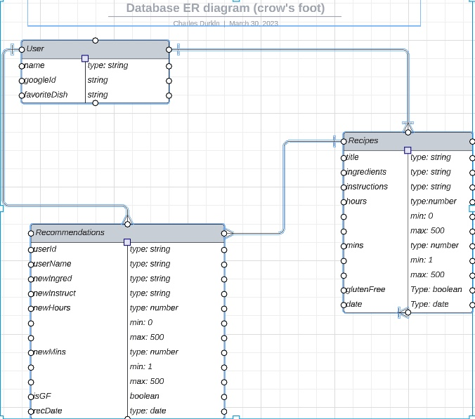
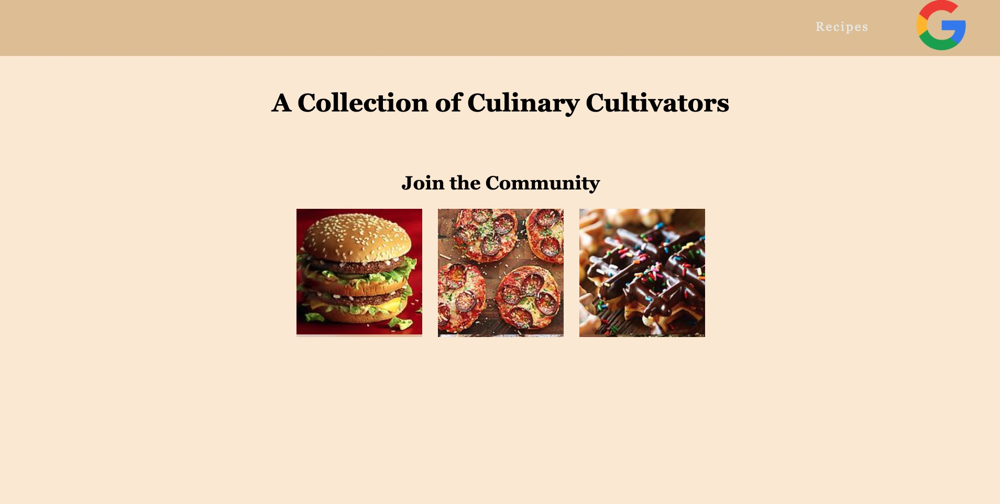
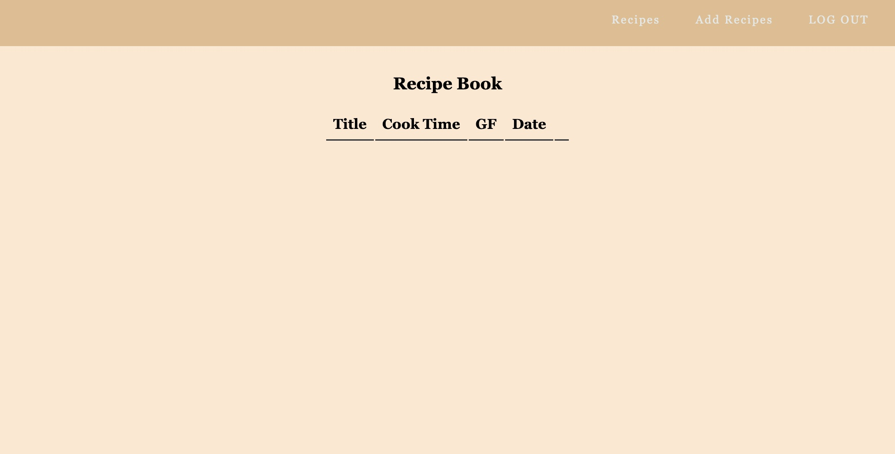
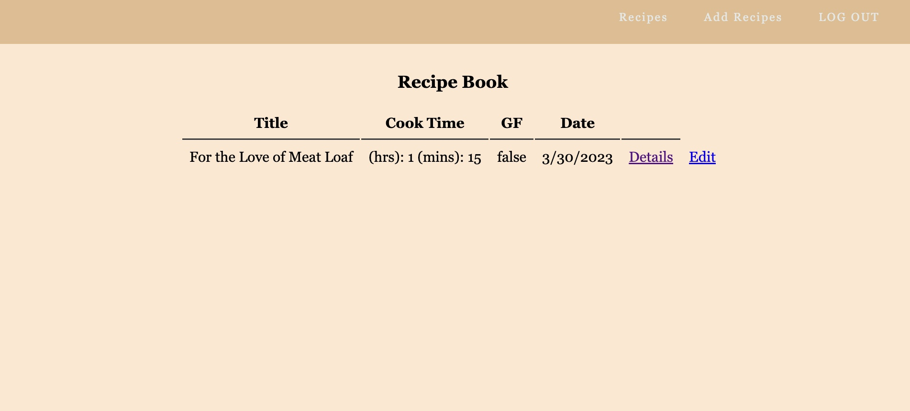
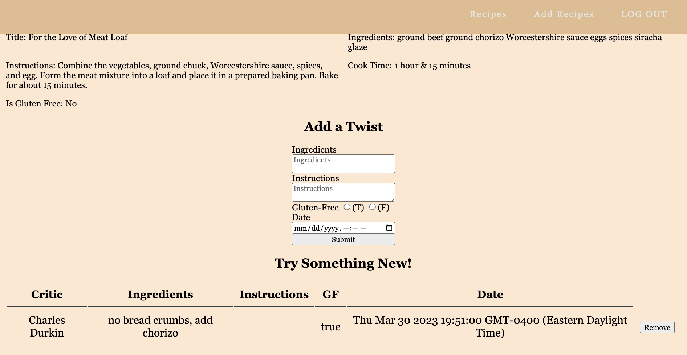
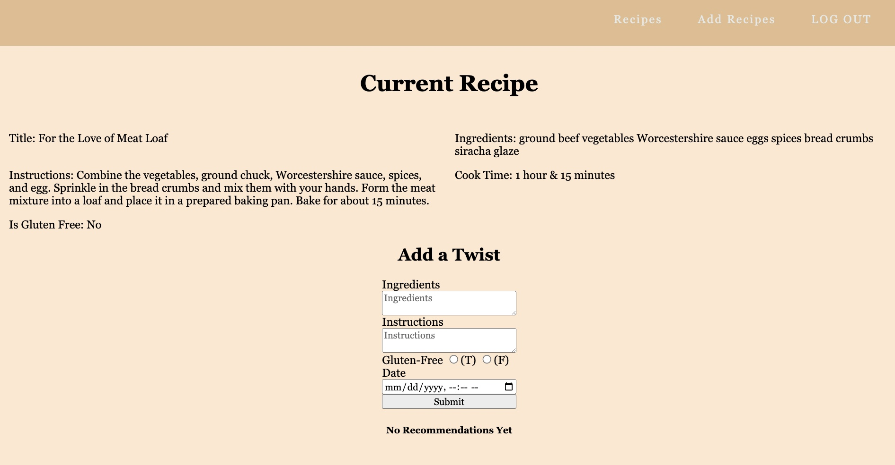

# Recipe App

## Technologies Used
HTML, CSS, javaScript, mongoDB, mongoose, express, node, MAC, Atlas, Cyclic 

## Screen Shots
 
 
 
 
 
 
 

## Getting Started
Clink the link to check it out!
https://navy-blue-hare-shoe.cyclic.app

## Next Steps
Add user profile page with user specific recipes, recommendations, ratings, and favorite dishes.
Add ability to upload picture to add to recipe description.
Add more interactive CSS transitions on clickables and hoverables.

Adjust section table structure